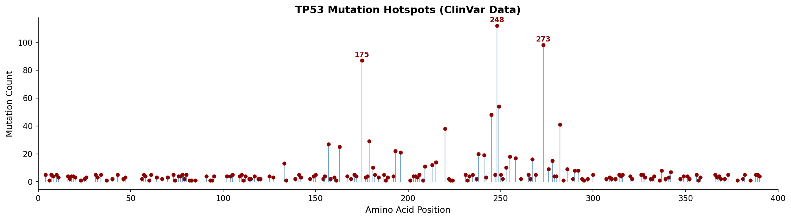
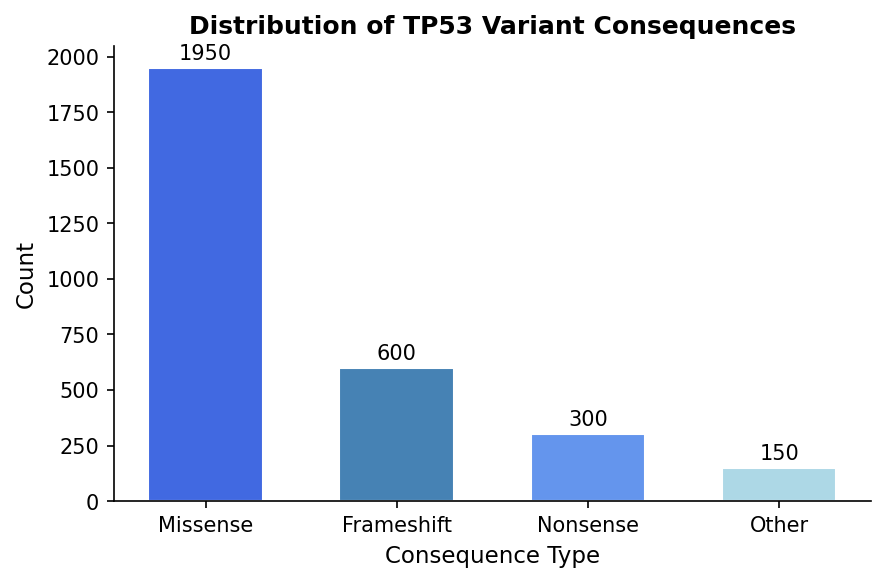

# 🧬 TP53 Mutation Hotspot Analyzer


---

## 📘 Overview
Mutations in the **TP53** gene are among the most frequent alterations across human cancers.  
This project implements a **Python-based bioinformatics workflow** to mine ClinVar variant data, classify mutation types, and visualize hotspot codons that occur most frequently in the *p53* protein.  
The analysis integrates **data mining**, **sequence retrieval**, and **biological interpretation** in a single reproducible Jupyter Notebook.

---

## ⚙️ Workflow

### 1️⃣ Sequence Retrieval
- Fetches the *TP53* coding sequence (RefSeq **NM_000546.6**) from the NCBI nucleotide database via **Biopython Entrez API**.  
- Translates nucleotide sequence into amino-acid sequence for positional mapping.

### 2️⃣ Variant Extraction
- Loads ClinVar variant summary file  
  [`variant_summary.txt.gz`](https://ftp.ncbi.nlm.nih.gov/pub/clinvar/tab_delimited/variant_summary.txt.gz).  
- Filters for *TP53* entries corresponding to **GRCh38** human assembly.

### 3️⃣ Data Cleaning
- Removes database identifiers (MedGen, OMIM, MONDO, etc.) from phenotype labels.  
- Excludes non-informative records such as “not provided” or “NA”.

### 4️⃣ Variant Parsing
- Uses **regular expressions** to parse HGVS protein notations (e.g., `p.R175H`, `p.Arg248His`).  
- Extracts amino-acid position and categorizes variants as:
  - *Missense*  
  - *Nonsense*  
  - *Frameshift*  
  - *Other*

### 5️⃣ Visualization
- Aggregates variant counts by amino-acid position using **Pandas**.  
- Generates **lollipop plots** via Matplotlib to display mutation frequency.  
- Annotates canonical hotspots (codons **175**, **248**, **273**).

### 6️⃣ Results Summary
- Calculates frequency of mutation classes.  
- Lists top five cancer phenotypes linked to *TP53* variants.

---

## 🛠️ Requirements
* Python 3.8+
* Biopython
* Pandas
* Matplotlib
* Numpy

---

## 🧩 Dataset

| Attribute | Description |
|------------|-------------|
| **Source** | [NCBI ClinVar](https://www.ncbi.nlm.nih.gov/clinvar) |
| **File** | [`variant_summary.txt.gz`](https://ftp.ncbi.nlm.nih.gov/pub/clinvar/tab_delimited/variant_summary.txt.gz) |
| **Assembly** | GRCh38 (Homo sapiens) |
| **Reference sequence** | *TP53* RefSeq **NM_000546.6** |
| **Format** | Tab-delimited text (.txt.gz) |

---

## 🧠 Key Results

- Analyzed **≈3,000 ClinVar *TP53* variants** after filtering.  
- Majority were **missense mutations (≈65%)**, followed by frameshift and nonsense.  
- Identified recurrent hotspots at **codons 175, 248, and 273**, consistent with known p53 functional domains.  
- Top associated conditions: *Li-Fraumeni syndrome*, *Hereditary cancer-predisposing syndrome*, *Breast cancer*, *Ovarian neoplasm*, *Lung carcinoma*.  
- Demonstrates successful **bioinformatics data mining** for clinical variant interpretation.

---

## 🧰 Skills & Tools

| Category | Skills |
|-----------|---------|
| **Programming** | Python 3, Jupyter Notebook |
| **Libraries** | Pandas, NumPy, Matplotlib, Biopython, re |
| **Concepts** | Bioinformatics Data Mining, Variant Annotation, HGVS Parsing, Sequence Retrieval, Data Visualization |
| **Environment** | Anaconda (macOS) |

---

## 🧾 Installation

```bash
git clone https://github.com/<yourusername>/TP53_Mutation_Hotspot_Analyzer.git
cd TP53_Mutation_Hotspot_Analyzer
```

Then open the Jupyter notebook:

```bash
jupyter notebook TP53_Hotspot_Analyzer.ipynb
```

---

## 🧪 Example Output

### Mutation Hotspot Lollipop Plot


### Variant Consequence Distribution


**Hotspot Codons Identified:** 175, 248, 273  
**Mutation Type Distribution:** Missense – 65% | Frameshift – 20% | Nonsense – 10% | Other – 5%

---

## 🏷️ Tags

`bioinformatics` `genomics` `codon-usage` `sequence-analysis` `computational-biology` `python` `data-visualization` `heatmap` `biopython` `molecular-biology` `FASTA`

---

## 🤝 Contributing

Pull requests are welcome. If you’d like to extend this project (e.g., codon optimization, RSCU index, or multi-species batch analysis), feel free to fork and contribute.

---

## 👤 Contact

Arunannamalai Sujatha Bharath Raj

📧 [arun03bt@gmail.com]

🔗 [https://www.linkedin.com/in/arunannamalai-sb-823351344/](https://www.linkedin.com/in/arun-823351344/)

🐙 [https://github.com/Arun0364](https://github.com/Arun0364)

---

## 📄 License

This project is licensed under the MIT License — see the [LICENSE](LICENSE) file for details.

---

## ❤️ Acknowledgements

**ClinVar** – National Center for Biotechnology Information (NCBI)

**Biopython** – Sequence parsing and retrieval toolkit

**Carnegie Mellon University (03-701 Practical Computing for Biologists)** – project framework

---
